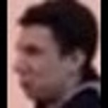
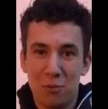
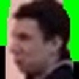
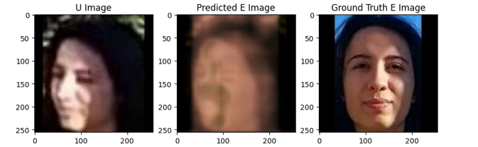
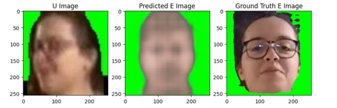

# Human-Recognition-in-Surveillance-Settings

The primary objective of this project is to enhance the quality of low-resolution images to high-resolution images. This main goal can be broken down into several specific tasks as listed below:

1. **Image Pre-Processing**
    - Standardize the proportions of the images by making them square, with black bands on both sides.
    - Estimate the head pose (Head Pose Estimation).
    - Perform facial segmentation (Face Segmentation).
2. **Train the Pix2Pix Model**
    - Train the Pix2Pix model on the respective dataset with and without segmentation.
3. **Critical Analysis**
    - Conduct a critical analysis of the results obtained from the model training.

This project aims to leverage advanced image processing techniques and machine learning models to improve image quality, providing a comprehensive approach from pre-processing to model training and result analysis.

---

### Database Structure

The database consists of a collection of videos in .mp4 format from 159 users, each contributing four videos. The videos are categorized based on their quality:

- **Good Quality Videos (Code "E")**: Two videos per user, where users look directly at the camera in a relaxed pose.
- **Poor Quality Videos (Code "U")**: Two videos per user, with variations in distance, angle, perspective, environment, lighting, and occlusions.

Each user has a total of one minute of video content, divided into four videos of thirty seconds each. The videos are recorded at a frame rate of ten frames per second and are in horizontal format.

#### Frame Extraction and Organization

The videos have been converted into frames and organized into subfolders within a main folder named "face_square" (that is **not** available in repo). This folder structure allows for easy access and management of the frames corresponding to each video.

- **Main Folder**: `face_square`
    - **Subfolders**: Each subfolder contains frames from a specific video.

This organization ensures that frames from good quality and poor quality videos are easily distinguishable and accessible for further processing or analysis.

---

### Pre-processing

#### Square Face Illustration

The faces were squared to convert them to a **unique size**.

<table>
  <tr>
    <td><strong>Poor Quality Videos (Code "U")</strong></td>
    <td><strong>Good Quality Videos (Code "E")</strong></td>
  </tr>
  <tr>
    <td></td>
    <td></td>
  </tr>
</table>

#### Face Segmentation

The faces were segmented to isolate the region of interest (**ROI**).

<table>
  <tr>
    <td><strong>Poor Quality Videos (Code "U")</strong></td>
    <td><strong>Good Quality Videos (Code "E")</strong></td>
  </tr>
  <tr>
    <td></td>
    <td></td>
  </tr>
</table>

---

### Pix2Pix Model from Scratch

The Pix2Pix model is a type of Generative Adversarial Network (GAN) aimed at mapping an input image to an output image.

In this project, the input images are frames from poor quality videos, and the output images are frames from good quality videos. The goal is to train the model to generate high-quality images from low-quality images.

#### U-Net Architecture

[Colab Implementation Code](pix2pix_model.ipynb)

- **Total Parameters**: 54,425,859 (207.62 MB)
- **Trainable Parameters**: 54,414,979 (207.58 MB)
- **Non-trainable Parameters**: 10,880 (42.50 KB)

#### Initial Values (Before Fine-tuning)

- **Batch Size**: 32
- **Early Stopping**: 2 (number of epochs without improvement)
- **Loss Function**: Mean Square Error (penalizes large errors more than small errors)
- **Number of Epochs**: Initially planned for 4 but had to be reduced due to computational cost

---

### Results

#### Non-Segmented Faces

**Training Conditions**:
- Utilization of 25% of the available dataset (34 users)
- One epoch
- Batch Size: 32

#### Segmented Faces

**Training Conditions**:
- Utilization of ~32% of the available dataset (50 users)
- One epoch
- Batch Size: 32

### To Find More

- **Presentation (Portuguese)**: [Presentation-Template.pptx](Presentation-Template.pptx)
- **Report**: [Relatory - Human_Recogn (6).pdf](Relatory - Human_Recogn (6).pdf)
